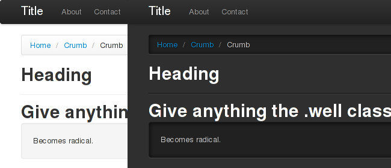

{:title "Darkstrap.css: A Dark Theme for Twitter Bootstrap 2"
 :permalink "4-darkstrap-css-a-dark-theme-for-twitter-bootstrap-2"
 :disqus-id "/posts/introducing-darkstrap"}

**Update (27th Jan 2013):** Darkstrap v0.9.0 released. Compatible with Twitter Bootstrap v2.2.2.

* New [Darkstrap vs. Bootstrap demo](/bag/darkstrap/darkstrap.html).
* More info on the [Github page](https://github.com/danneu/darkstrap).

I'm still ironing out some cross-browser issues (but it's still better than the original darkstrap.css).

It's also when I decided to start versioning it at v0.9.0. I'd like v1.0 to be a solid release across browsers.

I'm also unsure of some decision decisions which I'd like to stabilize for v1.0.

----

A couple days ago, [Mark Otto](http://twitter.com/mdo) and [Jacob Thorton](http://twitter.com/fat) released [Twitter Bootstrap 2.0](http://twitter.github.com/bootstrap/), the latest version of their popular html/css/js toolkit. It's nice and clean... and very white.

I'm working on a project that demands a darker theme, so I made `darkstrap.css` that turns the lights out on Bootstrap vanilla. Just include it after the Bootstrap stylesheet so it can cascade over the lighter theme.

```html
<link href='stylesheets/darkstrap.css' rel='stylesheet' />
```

Simple as.

# Check it out

* Demo: [Darkstrap vs. Bootstrap](/bag/darkstrap/darkstrap.html)
* Download `darkstrap.css`
* Darkstrap on [Github](https://github.com/danneu/darkstrap) 



# Legacy Darkstrap

I preserved the original darkstrap.css if anybody needs it for whatever reason.

* [Original demo](/bag/darkstrap/legacy/darkstrap.html)
* [Original darkstrap.css file](/bag/darkstrap/legacy/css/darkstrap.css)
