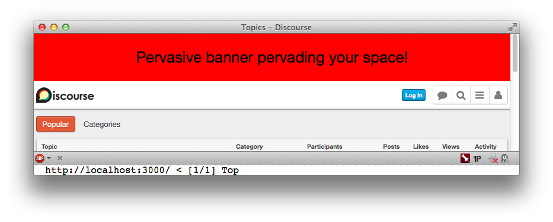

{:title "Tutorial: Your first Discourse plugin"
 :permalink "your-first-discourse-plugin-tutorial"
 :disqus-id "/posts/your-first-discourse-plugin-tutorial"}

## What's Discourse?

Jeff Atwood, co-founder of [StackOverflow](http://stackoverflow.com), recently released the beta of [Discourse](http://discourse.org), a forum system that hopes to become the Wordpress of forum software. 

I've been running a large vBulletin forum since 2007 and the very idea of migrating my community from legacy 2000-era forum software compelled me enough to teach myself Ruby and Rails.

So I naturally was drawn to Discourse as an opportunity to revive my passion for online communities and hopefully contribute to its codebase in a way more substantial than fixing comment typos.

Check it out: [http://meta.discourse.org](http://meta.discourse.org)

## Making our first plugin

Discourse has a plugin system and it ships with a few plugins. I made a bare-bones Hello World plugin to see what the bare minimum entailed.

So now I'm sharing that with you. I don't dive very deep, but it's a quick superficial crash course.

I'll try to keep it up to date over time as the plugin API changes.

## What our plugin will do

We'll be making a plugin called **DiscoursePervasiveBanner**.

All it does is pester your users by announcing its presence at the top of every page of the Discourse site.



Mmm. Glorious.

We'll do this by introducing two files to the Rails asset pipeline via the plugin system:

* **discourse_pervasive_banner.js**: Adds our banner `<div>` to the top of the page.
* **discourse_pervasive_banner.css**: Styles our banner. Makes it glorious.

## What plugins are

You can see the plugins that Discourse ships with. They're sitting in the `vendor/gems` directory.

```text
├── vendor
│   ├── gems
│   │   ├── discourse_plugin
│   │   ├── discourse_emoji
│   │   ├── discourse_poll
│   │   ├── discourse_task
│   │   ├── ...
│   │
```

Each one is packaged as a gem and then required in Discourse's Gemfile.

```ruby
gem 'discourse_plugin', path: 'vendor/gems/discourse_plugin'
gem 'discourse_emoji', path: 'vendor/gems/discourse_emoji'
...
```

The `discourse_plugin` plugin is what plugins descend from. It implements the behavior that will actually interact with Discourse's `DiscoursePluginRegistry`.

They could easily be released on RubyGems and removed from the vendor/ directory, but we'll start here.

## How plugins work

Discourse uses a class called `DiscoursePluginRegistry` that plugins will register Javascripts and Stylesheets with by using its `register_css` and `register_js` methods.

Then, any appended assets are looped through and required in the Discourse app's stylesheet and javascript manifests:

```ruby
# app/assets/javascripts/application.js.erb
...
<%
  # Include plugin javascripts
  DiscoursePluginRegistry.javascripts.each do |js|
    require_asset(js)
  end 
%>
```

```ruby
# app/assets/stylesheets/application.css.erb
...
<%
  # Include plugin stylesheets 
  DiscoursePluginRegistry.stylesheets.each do |css|
    require_asset(css)
  end
%>
```

It's pretty simple. Our plugin just registers files to be included in each of those loops, thus integrated into the Rails asset pipeline.

## 1. Creating a plugin skeleton

We'll follow suit and create our plugin in the `vendor/gems/` directory.

`cd` into that directory and use Bundler to generate our plugin skeleton:

```shell
bundle gem discourse_pervasive_banner 
```
    
([View the commit](https://github.com/danneu/discourse_pervasive_banner/commit/fd566106d7ba76b6b5544324075db63db963089c))

### What the skeleton looks like

```text
discourse_pervasive_banner
├── lib
│   ├── discourse_pervasive_banner.rb
│   ├── discourse_pervasive_banner
│   │   ├── version.rb
```

This is just standard gem stuff.

* `lib/discourse_pervasive_banner.rb` requires our implementation files that are stored in `lib/discourse_pervasive_banner/**`
* So far it only requires `version.rb` which defines our gem's version.

### What our plugin hierarchy will look like when we're done

```text
discourse_pervasive_banner
├── lib
│   ├── discourse_pervasive_banner.rb
│   ├── discourse_pervasive_banner
│   │   ├── version.rb
│   │   ├── engine.rb
│   │   ├── plugin.rb
├── vendor
│   ├── assets
│   │   ├── stylesheets
│   │   │   ├── discourse_pervasive_banner.css.sass
│   │   ├── javascripts
│   │   │   ├── discourse_pervasive_banner.js
```

## 2. Adding a Rails Engine (engine.rb)

Most of the following boilerplate was modified from the existing `discourse_emoji` plugin. You can learn more by looking at Discourse's included plugins.

This file creates an Engine for our plugin for the purpose of adding itself to the plugin registry during Rails' `after_initialize` hook.

* Rails Guides: [Getting Started with Engines](http://guides.rubyonrails.org/engines.html)
* Rails Guides: [Initializers](http://guides.rubyonrails.org/configuring.html#initializers)

Let's add `engine.rb`:

```ruby
# lib/discourse_pervasive_banner/engine.rb
require 'discourse_pervasive_banner/plugin'

module DiscoursePervasiveBanner
  class Engine < Rails::Engine

    engine_name 'discourse_pervasive_banner'

    initializer "discourse_pervasive_banner.configure_rails_initialization" do |app|

      app.config.after_initialize do 
        DiscoursePluginRegistry.setup(DiscoursePervasiveBanner::Plugin)
      end
    end

  end
end
```

The line `DiscoursePluginRegistry.setup(DiscoursePervasiveBanner::Plugin)` instantiates our plugin with a registry instance and then runs the plugin's own `#setup` method which registers assets with the registry.

Here's how it's implemented behind the scenes:

```ruby
# Inside DiscoursePluginRegistry  
def self.setup(plugin_class)    
  registry = DiscoursePluginRegistry.new
  plugin = plugin_class.new(registry)
  plugin.setup
end
```

Creating an Engine is what will tell Rails to see our plugin's `vendor/` directory which is where we have our assets. In other words, our assets are added to the Rails app's load path. That's how `DiscoursePluginRegistry` can just `require` them in the asset manifest loops without a load error.

([View the commit](https://github.com/danneu/discourse_pervasive_banner/commit/75758a3c5fbfaa74e287d7a3e61a097a4bf04b65))

## 3. Implementing our plugin's `#setup` method (plugin.rb)

Since Discourse plugins inherit from `DiscoursePlugin`, here are the implementations of the two method's we'll be using inside our subclasses plugin:

```ruby
# Inside DiscoursePlugin::Plugin
def register_js(file, opts={})
  @registry.register_js(file, opts)
end

def register_css(file)
  @registry.register_css(file)
end
```

In other words, all that our plugin does is delegate to the `DiscoursePluginRegistry` instance that's passed to it.

Here's our `plugin.rb` file:

```ruby
# lib/discourse_pervasive_banner/plugin.rb
require 'discourse_plugin'

module DiscoursePervasiveBanner

  class Plugin < DiscoursePlugin
    
    def setup
      # Add our Assets
      register_js('discourse_pervasive_banner')
      register_css('discourse_pervasive_banner')
    end

  end
end
```

([View the commit](https://github.com/danneu/discourse_pervasive_banner/commit/003214171df47e2c3196aa94d6ce4141aa54eb43))

## 4. Creating our pervasive banner with javascript

Our assets are required after Discourse's assets, so we can rely on jQuery's existence.

```javascript
// vendor/assets/javascripts/discourse_pervasive_banner.js
(function() {
  $("body").prepend("<div id='pervasive-banner'>Pervasive banner pervading your space!</div>");
}).call(this);
```

The `.call(this)` is a standard way for executing our javascript in the context of the code that calls it. 

([View the commit](https://github.com/danneu/discourse_pervasive_banner/commit/07bd45aab2a00adeebf57225c3de89b601d307b7))

## 5. Styling our pervasive banner with CSS

Note that we can use whatever processors available in the Discourse app since our files are required into the app's asset pipeline. We could've written our javascript with coffeescript, and here we'll write our CSS with Sass.

```css
/* vendor/assets/stylesheets/discourse_pervasive_banner.css.sass */
#pervasive-banner
  background: red
  height: 100px
  line-height: 100px
  text-align: center
  font-size: 32px
```

([View the commit](https://github.com/danneu/discourse_pervasive_banner/commit/1dcbbaffed8f7cb53c28bf235ad0d1336aa8bb07))

## 6. Loading our plugin files

The files in our plugin's `lib/` directory aren't automatically loaded. By standard gem convention, we explicitly require them:

```ruby
# lib/discourse_pervasive_banner.rb
require "discourse_pervasive_banner/version"
require "discourse_pervasive_banner/engine"  # <-- added
require "discourse_pervasive_banner/plugin"  # <-- added

module PervasiveBanner
  # Your code goes here...
end
```

This file acts like the "require hub" of a gem.

I put this in its own step because it's easy to forget.

## 7. Adding our plugin to the Discourse Gemfile

Now we need to actually tell Discourse about our plugin by adding it to the master Gemfile of the app we want to use our plugin.

```ruby
# discourse/Gemfile
...
gem 'discourse_pervasive_banner', path: 'vendor/gems/discourse_pervasive_banner'
...
```

We specify the path since our plugin only exists in the app's 'vendor/' directory. But we obviously wouldn't need that if our plugin was released on RubyGems where it'd be downloaded into the app.

Don't forget to:

```shell
$ bundle install
```

And you may need to:

```shell
$ rake assets:precompile
```

## That's it! 

* [Email me](mailto:danrodneu@gmail.com) for questions/comments/corrections. :)
* You can find the full plugin source on Github: [danneu/discourse_pervasive_banner](https://github.com/danneu/discourse_pervasive_banner)

<script>
var banner = document.createElement('div');
banner.innerHTML = "Pervasive banner pervading your space!";
banner.className = "pervasive-banner";
document.body.insertBefore(banner, document.body.childNodes[0]);
</script>

<style>
.pervasive-banner {
  background: red;
  height: 100px;
  line-height: 100px;
  text-align: center;
  font-size: 32px;
  color: black;
  margin-top: -50px;
}
</style>


